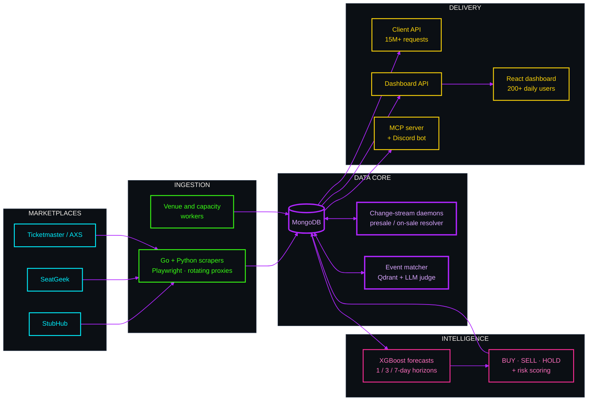
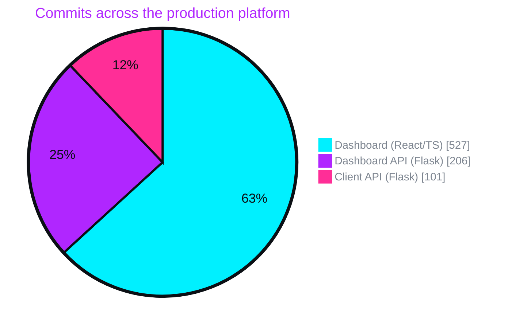

B.Tech Computer Science, NSUT Delhi '24 · Noida, India

  

---

## `~` About

I work on **data infrastructure for live-event ticketing** — the systems that scrape, reconcile, and forecast a market where prices move by the minute and the source data is hostile, inconsistent, and rate-limited.

Day to day that means distributed scrapers behind rotating proxy pools, MongoDB change-stream daemons that keep denormalized fields honest, vector search for entity resolution across marketplaces, and gradient-boosted models that turn all of it into a price call.

> Most of my work ships in private and organization repositories, so the sections below describe the systems rather than link to them.

---

## `🚀` Ticketmetric — Production Platform

<table>
<tr>
<td width="33%" valign="top">

### 🔌 Client API
[**`API docs ↗`**](https://api-client.ticketmetric.io/api/client/docs/)

Built **from scratch.** The public data API — Bearer API-key auth, Redis-backed rate limiting, tiered membership plans, and live Swagger docs.

**15M+ requests** served across **30+ client integrations.**

`Flask` `Redis` `MongoDB` `PM2`

</td>
<td width="33%" valign="top">

### 📊 Dashboard
[**`app.ticketmetric.io ↗`**](https://app.ticketmetric.io/dashboard/upcoming)

The customer-facing analytics product. **Led the full migration off MUI to shadcn/ui + Radix + Tailwind v4** — a ground-up rebuild of the component layer.

**200+ daily active users.**

`React` `TypeScript` `Tailwind v4` `Stripe`

</td>
<td width="33%" valign="top">

### ⚡ Dashboard API
`ticket_flask_api`

The analytics backend behind the dashboard — live sales, price history, presale/on-sale filtering, searchable inventory, and hot-section reporting.

`Flask` `MongoDB` `Docker` `Gunicorn`

</td>
</tr>
</table>

### How it fits together

---

## `⚙` Other Systems I've Built

| System | What it does | Stack |
| :--- | :--- | :--- |
| **Cross-Marketplace Event Matcher** | Resolves the same real-world event across two ticket marketplaces despite mismatched names, venue aliases, tours, and multi-day passes. Vector similarity first, knowledge graph for aliases, LLM judge only for borderline cases. | `FastAPI` `Qdrant` `FastEmbed` `NetworkX` `GPT-4o-mini` |
| **Price Forecasting Engine** | Daily feature snapshots → median price forecasts at 1/3/7-day horizons, up/down direction classification, and BUY / SELL / HOLD calls with confidence and per-event risk scores. | `XGBoost` `pandas` `scheduled training` |
| **First-Sale Field Refresher** | Keeps precomputed presale/on-sale dates correct across platforms with conflicting conventions. Runs as both a change-stream daemon (reacts in seconds) and a cron sweep (safety net for missed resume tokens). | `MongoDB Change Streams` `Slack alerting` |
| **Distributed Ticket Scrapers** | Multi-source collection behind a rotating proxy pool with structured logging and per-source persistence strategies. Hot paths rewritten in Go for throughput. | `Go` `Playwright` `Redis` `MongoDB` |
| **MCP Server + Discord Bot** | Model Context Protocol server exposing the data layer to LLMs, with a Discord bot front-end for natural-language queries over the event database. | `MCP` `Python` `Discord API` |
| **Browser Extension** | Ticketmetric extension surfacing live pricing and inventory signals directly on marketplace pages. | `TypeScript` `Chrome APIs` |

### Where my commits go

---

## `★` Selected Public Work

<table>
<tr>
<td width="50%" valign="top">

### [predii](https://github.com/aryansingh3/predii) ⭐ 4
Custom **named-entity recognition for the automotive domain** — a fine-tuned spaCy NER model plus a quantized Llama-2 7B, both published to Hugging Face with a hosted inference space and a full research write-up.

 

</td>
<td width="50%" valign="top">

### [timezone-lookup](https://github.com/aryansingh3/timezone-lookup)
Offline timezone resolution from a postal code or city/state/country. 200k+ city GeoNames database, 80+ countries, normalization for abbreviations and accents, optional Redis cache.

 

</td>
</tr>
<tr>
<td width="50%" valign="top">

### [audio-sentiment-analysis](https://github.com/aryansingh3/sentiment-analysis-by-analysing-audio)
Extracts sentiment, named entities, and conversation topics directly from audio, with a React front-end for exploring results.

 

</td>
<td width="50%" valign="top">

### [blacklight-studios](https://github.com/aryansingh3/blacklight_studios)
Full-stack leaderboard service — current and historical weekly rankings, country filtering, and rank lookup by user ID. Deployed front and back.

 

</td>
</tr>
<tr>
<td width="50%" valign="top">

### [self-driving-car](https://github.com/aryansingh3/self-driving-car)
Neural-network-driven car learning to navigate traffic in a browser simulation, with sensors and a visualized network.

 

</td>
<td width="50%" valign="top">

### [sorting-visualizer](https://github.com/aryansingh3/sorting-visualizer)
Step-through visualization of classic sorting algorithms with adjustable array size and animation speed.

 

</td>
</tr>
</table>

---

## `📄` Research

<table>
<tr>
<td valign="top">

### [Comparative Analysis for Speech Recognition using DeepSpeech](https://ieeexplore.ieee.org/document/10739129/)

**IEEE · 2024 International Conference on Electrical, Electronics and Computing Technologies** — Sharda University, 29 Aug 2024. Co-authored with NSUT Delhi faculty.

Automatic speech recognition for **English and Hindi** using a hybrid architecture: CNNs for feature extraction, RNNs for sequence learning, joined by **connectionist temporal classification** so transcription needs no linguistic pre-segmentation. Trained and evaluated on **LJSpeech** (English) and **OpenSLR** (Hindi), measured by **Word Error Rate**.

</td>
</tr>
</table>

---

## `⌨` Toolbox

**Languages**

**Backend & Data**

**Frontend**

**ML & AI**

**Infra**

---

## `📊` By The Numbers

<picture>
  <source media="(prefers-color-scheme: dark)" srcset="https://github-readme-stats.vercel.app/api?username=aryansingh3&show_icons=true&count_private=true&include_all_commits=true&hide_border=true&bg_color=00000000&title_color=B026FF&icon_color=00F0FF&text_color=C9D1D9" />
  
</picture>
<picture>
  <source media="(prefers-color-scheme: dark)" srcset="https://streak-stats.demolab.com?user=aryansingh3&hide_border=true&background=00000000&stroke=30363D&ring=B026FF&fire=FF2E97&currStreakLabel=00F0FF&sideLabels=C9D1D9&currStreakNum=C9D1D9&sideNums=C9D1D9&dates=8B949E" />
  
</picture>

 

<picture>
  <source media="(prefers-color-scheme: dark)" srcset="https://github-readme-stats.vercel.app/api/top-langs/?username=aryansingh3&layout=donut&langs_count=6&hide=jupyter%20notebook,c,cython,fortran,powershell,smarty,css,html&hide_border=true&bg_color=00000000&title_color=B026FF&text_color=C9D1D9" />
  
</picture>

---

## `📈` Contribution Activity

<picture>
  <source media="(prefers-color-scheme: dark)" srcset="https://github-readme-activity-graph.vercel.app/graph?username=aryansingh3&bg_color=00000000&color=C9D1D9&line=00F0FF&point=FF2E97&area_color=B026FF&area=true&hide_border=true&custom_title=Commits%20over%20the%20last%20year" />
  
</picture>

  

 

Most of my commits land in private and organization repositories — the graphs above count them, the repo list can't show them.

Open to conversations about backend systems, data pipelines, and applied ML.

